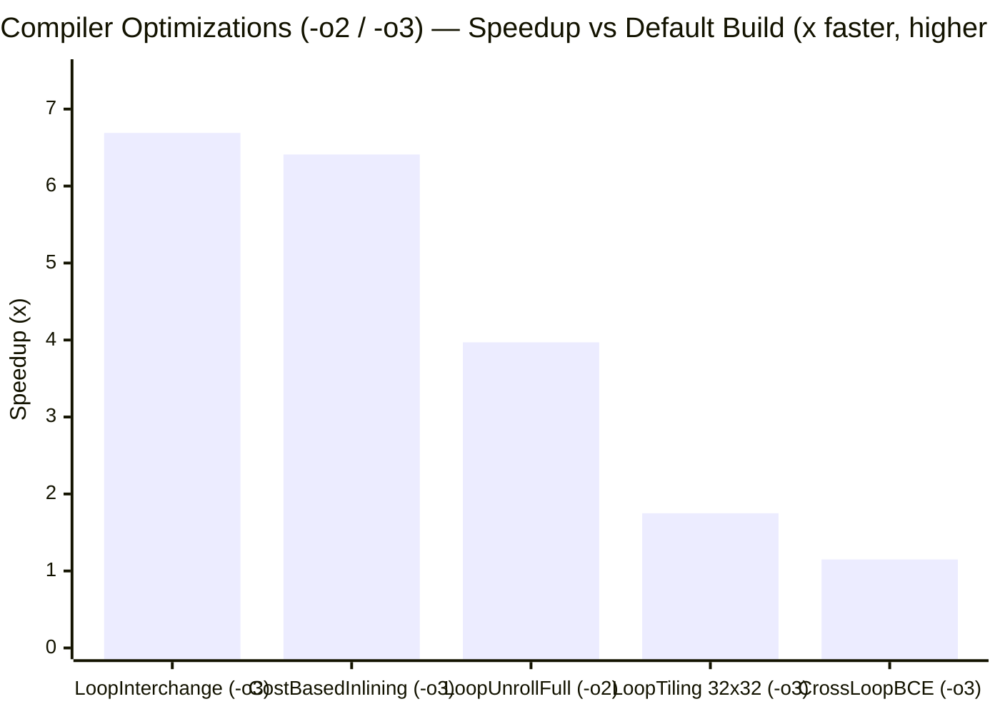
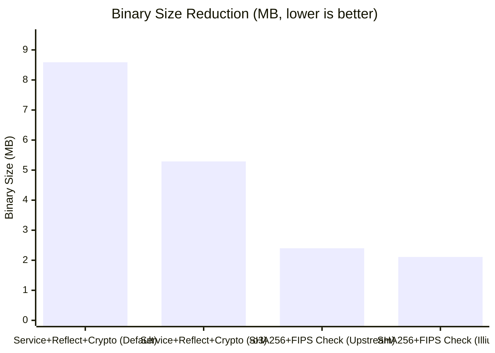

# The Go Programming Language Illium

Go is an open source programming language that makes it easy to build simple,
reliable, and efficient software.

This fork is a personal Go branch maintained by 404Setup.

## Features

> This fork does not modify language syntax or break existing standard library APIs.

### Standard Library & Runtime
- **`sync/v2`**: Generic `Pool[T]` and `Map[K, V]` (`HashTrieMap` with online `Shrink()`), with standard library internal usages migrated from `sync`.
- **`sync/v2/container`**: Generic map containers: `OrderedMap[K, V]`, `ConcurrentSkipListMap[K, V]`, `LinkedHashMap[K, V]`, and `TreeMap[K, V]`.
- **`sync/atomic/v2`**: Generic `Value[T]` avoiding interface boxing for scalar and pointer operations.
- **`net`**: Built-in TTL-aware DNS response cache (RFC 1035 / RFC 2308 negative caching, lock-free lookup, RFC 6724 route cache; disable with `GODEBUG=netdnscache=0`) and DNS address shuffling before RFC 6724 sorting.
- **`net/http`**: Reduced allocations and faster parsing/formatting for cookies, status lines, headers, and `ServeMux` routing.
- **`reflect`**: Allocation and throughput optimizations for `Equal`, `DeepEqual`, `Comparable`, `Value.Call`, `Select`, and struct field introspection.
- **`runtime`**: Synchronous unmarked span reclamation before heap growth (`reclaimBeforeGrow`), fused 64-bit word-wide zombie check and allocation counting during span sweep (`countAllocAndCheckZombies`), `TrailingZeros8`/`TrailingZeros32` bit scanning in `reclaimChunk`, `scanblock`, `markrootSpans`, and `typeBitsBulkBarrier`, `tp.nextFast` and `nil`-pointer filtering in bulk write barriers, consecutive pointer deduplication in `wbBufFlush1` and GreenTeaGC span/object scanners, empty `spanSet.reset` STW fast path, `workbuf`/`wbBuf` bounds checks, and zero-size fast paths in `makeslice`, `makeslicecopy`, `rawbyteslice`, and `rawruneslice`.
- **`cmd/compile`**: Tiered stack small-buffer optimization (SBO) for non-escaping dynamic `make` and `make+copy` (`128 B` pointerless / `64 B` pointer-bearing), inlining budget promotion for dynamic `make` helpers, and static constant propagation for `make` and `[]byte(s)`.
- **`crypto/fips140`**: Compile-time and link-time dead code elimination of FIPS 140 integrity checks and self-tests when `GOFIPS140=off`.
- **`cmd/go`**: Terminal progress indicator (`Building [====   ] x/y`) for `go build` and `go install`.

### Compiler & Linker Flags
- **`-ldflags="-o2"`**: Bounded loop unrolling and post-SCCP/prove dead branch elimination.
- **`-ldflags="-o3"`**: Includes `-o2`, plus cost-based inlining, 2D loop interchange and $32 \times 32$ tiling, dead finite loop removal, cross-loop bounds check elimination, wrapper tail calls, and two-stage reflection/interface linker dead code elimination.
- **`-ldflags="-fmth"`**: Fast-math SSA reductions, reciprocal division, FMA contraction, polynomial approximations for `math` transcendentals, and hardware `FTZ`/`DAZ` mode (may relax strict IEEE 754 semantics).

Use `all=` (e.g., `-ldflags="all=-o3"`) to apply flags across all dependencies.

---

## Benchmarks

All benchmarks below were executed on `linux/amd64` (Intel Xeon Platinum 8481C) comparing upstream Go against Illium.

### 1. `sync/v2`, `sync/v2/container`, and `sync/atomic/v2`

```mermaid
xychart-beta
    title "Concurrency Primitives: v1 (left bar) vs v2 (right bar) — Latency (ns/op, lower is better)"
    x-axis ["Map.Load (Hits)", "Map.Mixed", "Pool (Struct Val)", "atomic.Store (int)", "atomic.Swap (int)", "atomic.CAS Mismatch"]
    y-axis "Latency (ns/op)" 0 --> 75
    bar [12.14, 52.23, 25.90, 17.18, 18.31, 69.03]
    bar [7.11, 38.81, 6.23, 5.77, 7.55, 9.79]
```

| Benchmark | `v1` (`sync` / `atomic`) | `v2` (`sync/v2` / `atomic/v2`) | Latency Delta | Allocs (`v1` → `v2`) |
| :--- | ---: | ---: | ---: | :---: |
| `MapLoadFreshEmpty` | 2.43 ns/op | **2.05 ns/op** | **-15.6%** (1.19×) | 0 → 0 |
| `MapLoadMostlyHits` | 12.14 ns/op | **7.11 ns/op** | **-41.4%** (1.71×) | 0 → 0 |
| `MapMixed` | 52.23 ns/op | **38.81 ns/op** | **-25.7%** (1.35×) | 6 B → 4 B |
| `PoolPointer` | 6.52 ns/op | **6.79 ns/op** | ~0% (parity) | 0 → 0 |
| `PoolValue` (32B struct) | 25.90 ns/op | **6.23 ns/op** | **-76.0%** (4.16×) | 1 (32 B) → **0 (0 B)** |
| `atomic.Value Load (int)` | 1.03 ns/op | **0.35 ns/op** | **-66.0%** (2.94×) | 0 → 0 |
| `atomic.Value Load (ptr, parallel)` | 4.70 ns/op | **3.66 ns/op** | **-22.1%** (1.28×) | 0 → 0 |
| `atomic.Value Store (int)` | 17.18 ns/op | **5.77 ns/op** | **-66.4%** (2.98×) | 7 B → **0 B** |
| `atomic.Value Swap (int)` | 18.31 ns/op | **7.55 ns/op** | **-58.8%** (2.43×) | 7 B → **0 B** |
| `atomic.Value CAS Mismatch (Large)` | 69.03 ns/op | **9.79 ns/op** | **-85.8%** (7.05×) | 1 (128 B) → **0 (0 B)** |

```mermaid
xychart-beta
    title "sync/v2/container Ordered & Sorted Maps — Latency by Operation (ns/op, lower is better)"
    x-axis ["LinkedHashMap", "OrderedMap (Concurrent)", "TreeMap (Sorted)", "ConcurrentSkipListMap"]
    y-axis "Latency (ns/op)" 0 --> 330
    bar [10.79, 21.00, 53.28, 85.54]
    bar [11.88, 47.61, 51.49, 120.03]
    bar [66.99, 252.73, 281.83, 319.97]
```
> *Bars per container (left to right): **Load**, **Store**, and **Delete+Store Churn** across 1,024 entries (`OrderedMap` parallel hit load: **9.04 ns/op**, 0 allocs/op).*

---

### 2. `net/http` Optimizations

```mermaid
xychart-beta
    title "net/http: Upstream (left bar) vs Illium (right bar) — Latency (ns/op, lower is better)"
    x-axis ["CookieString", "CopyValues", "ServerMatch (Mux)", "ReadRequest (Wrk)", "ReadRequest (Curl)", "ReadSetCookies"]
    y-axis "Latency (ns/op)" 0 --> 2000
    bar [419.2, 756.5, 921.3, 919.2, 1239.7, 1864.3]
    bar [360.9, 856.0, 618.1, 785.5, 1069.3, 1412.7]
```

| Benchmark | Upstream Go | Illium | Latency Delta | Allocs (`Upstream` → `Illium`) |
| :--- | ---: | ---: | ---: | :---: |
| `StatusText` | 3.41 ns/op | **0.35 ns/op** | **-89.7%** (9.74×) | 0 → 0 |
| `ResponseStatusLine404` | 14.83 ns/op | **3.56 ns/op** | **-76.0%** (4.17×) | 0 → 0 |
| `CookieString` | 419.2 ns/op | **360.9 ns/op** | **-13.9%** (1.16×) | 1 (176 B) → **1 (144 B)** |
| `ReadSetCookies` | 1,864 ns/op | **1,413 ns/op** | **-24.2%** (1.32×) | 21 (1,168 B) → **11 (726 B)** |
| `ReadCookies/ParseCookie` | 2,254 ns/op | **2,234 ns/op** | **-0.9%** | 11 (2,000 B) → **2 (2,128 B)** (-81.8% allocs) |
| `CopyValues` | 756.5 ns/op | **856.0 ns/op** | +13.1% | 11 (736 B) → **6 (784 B)** (-45.5% allocs) |
| `ServerMatch` (`ServeMux`) | 921.3 ns/op | **618.1 ns/op** | **-32.9%** (1.49×) | 10 (791 B) → **5 (568 B)** (-50.0% allocs) |
| `ServeMux` (end-to-end) | 43.03 µs/op | **32.82 µs/op** | **-23.7%** (1.31×) | 360 → 360 |
| `ReadRequest/Wrk` | 919.2 ns/op | **785.5 ns/op** | **-14.5%** (1.17×) | 7 (912 B) → **6 (896 B)** |
| `ReadRequest/Curl` | 1,240 ns/op | **1,069 ns/op** | **-13.8%** (1.16×) | 9 (960 B) → **8 (944 B)** |
| `ServerFakeConn/KeepAliveLite` | 3,929 ns/op | **3,505 ns/op** | **-10.8%** (1.12×) | 12 (1,312 B) → **10 (1,248 B)** |

---

### 3. `net` DNS Resolver Cache

```mermaid
xychart-beta
    title "net DNS Resolver: Uncached (left bar) vs Cached (right bar) — Latency (ns/op, lower is better)"
    x-axis ["LookupHost (Dual-Stack)", "LookupHost (Parallel)", "LookupTXT"]
    y-axis "Latency (ns/op)" 0 --> 46000
    bar [44548, 44548, 3612]
    bar [1436, 1279, 467.6]
```

| Benchmark | Uncached (`netdnscache=0`) | Cached (Default) | Latency Delta | Allocs (`Uncached` → `Cached`) |
| :--- | ---: | ---: | ---: | :---: |
| `DNSLookupHost` (A + AAAA + RFC 6724) | 44,548 ns/op | **1,436 ns/op** | **-96.8%** (31.02×) | 74 (10,136 B) → **10 (288 B)** |
| `DNSLookupHostParallel` | 44,548 ns/op | **1,279 ns/op** | **-97.1%** (34.83×) | 74 (10,136 B) → **10 (288 B)** |
| `DNSLookupTXT` | 3,612 ns/op | **467.6 ns/op** | **-87.1%** (7.72×) | 22 (4,216 B) → **5 (112 B)** |

---

### 4. `reflect` Optimizations

```mermaid
xychart-beta
    title "reflect: Upstream (left bar) vs Illium (right bar) — Latency (ns/op, lower is better)"
    x-axis ["Equal (Struct)", "Comparable", "AppendSlice", "DeepEqual ([]int)", "Call (Method)", "Call (Variadic)", "MapsDeepEqual", "Select (8)", "VisibleFields"]
    y-axis "Latency (ns/op)" 0 --> 750
    bar [54.53, 170.8, 60.58, 82.79, 250.1, 328.0, 340.9, 371.6, 727.3]
    bar [6.28, 16.36, 29.37, 31.70, 184.9, 229.8, 141.6, 314.4, 223.2]
```

| Benchmark | Upstream Go | Illium | Latency Delta | Allocs (`Upstream` → `Illium`) |
| :--- | ---: | ---: | ---: | :---: |
| `Comparable` (struct) | 170.8 ns/op | **16.36 ns/op** | **-90.4%** (10.44×) | 7 (100 B) → **0 (0 B)** |
| `Equal/RegularMemory` | 54.53 ns/op | **6.28 ns/op** | **-88.5%** (8.68×) | 0 → 0 |
| `DeepEqual/[][6]uint8` | 144.7 ns/op | **35.81 ns/op** | **-75.3%** (4.04×) | 0 → 0 |
| `VisibleFields/Flat` | 727.3 ns/op | **223.2 ns/op** | **-69.3%** (3.26×) | 11 (1,080 B) → **2 (624 B)** |
| `DeepEqual/[]int` | 82.79 ns/op | **31.70 ns/op** | **-61.7%** (2.61×) | 0 → 0 |
| `MapsDeepEqual` | 340.9 ns/op | **141.6 ns/op** | **-58.5%** (2.41×) | 6 (48 B) → **0 (0 B)** |
| `AppendSlice` | 60.58 ns/op | **29.37 ns/op** | **-51.5%** (2.06×) | 2 (48 B) → **1 (24 B)** |
| `Convert/CanConvert` | 9.40 ns/op | **6.20 ns/op** | **-34.0%** (1.52×) | 0 → 0 |
| `Convert/IntToString` | 56.74 ns/op | **38.64 ns/op** | **-31.9%** (1.47×) | 2 (20 B) → 2 (20 B) |
| `CallSerial/Variadic` | 328.0 ns/op | **229.8 ns/op** | **-29.9%** (1.43×) | 4 (80 B) → **3 (56 B)** |
| `CallSerial/Method` | 250.1 ns/op | **184.9 ns/op** | **-26.1%** (1.35×) | 3 (40 B) → **2 (32 B)** |
| `Select/8` | 371.6 ns/op | **314.4 ns/op** | **-15.4%** (1.18×) | 11 (512 B) → **4 (456 B)** |

---

### 5. Compiler & Linker Optimizations (`-o2`, `-o3`, `-fmth`, and `GOFIPS140`)

#### Loop, Inlining & Bounds Optimizations (`-o2` and `-o3`)

```mermaid
xychart-beta
    title "Compiler Optimizations (-o2 / -o3) — Speedup vs Default Build (x faster, higher is better)"
    x-axis ["LoopInterchange (-o3)", "CostBasedInlining (-o3)", "LoopUnrollFull (-o2)", "LoopTiling 32x32 (-o3)", "CrossLoopBCE (-o3)"]
    y-axis "Speedup (x)" 0 --> 7.5
    bar [6.69, 6.41, 3.97, 1.75, 1.15]
```

| Optimization Benchmark | Flag | Default Build | Optimized Build | Latency Delta / Speedup |
| :--- | :---: | ---: | ---: | ---: |
| `LoopInterchange` ($512 \times 512$ column-to-row) | `-o3` | 1,974 µs/op | **295.2 µs/op** | **-85.1%** (6.69× faster) |
| `CostBasedInlining` (specialization + devirt) | `-o3` | 163.8 ns/op | **25.57 ns/op** | **-84.4%** (6.41× faster) |
| `LoopUnrollFull` (8-trip fixed loop) | `-o2` | 6.31 ns/op | **1.59 ns/op** | **-74.8%** (3.97× faster) |
| `LoopTiling` ($512 \times 512$ transpose, $32 \times 32$ tiles) | `-o3` | 1,340 µs/op | **767.1 µs/op** | **-42.8%** (1.75× faster) |
| `CrossLoopBCE` (nested token scanner) | `-o3` | 83.93 ns/op | **72.71 ns/op** | **-13.4%** (1.15× faster) |

#### Floating-Point Optimizations (`-fmth`)

```mermaid
xychart-beta
    title "Fast-Math (-fmth): Default IEEE-754 (left bar) vs -fmth (right bar) — Latency (ns/op, lower is better)"
    x-axis ["math.Pow", "math.Log", "math.Cos", "math.Sin", "math.Exp", "ReciprocalDiv (3x)"]
    y-axis "Latency (ns/op)" 0 --> 46
    bar [43.17, 9.00, 9.10, 8.36, 7.49, 4.11]
    bar [17.04, 5.26, 8.08, 8.04, 6.79, 1.95]
```

| Floating-Point Benchmark | Default (IEEE 754) | `-ldflags="all=-fmth"` | Latency Delta / Speedup |
| :--- | ---: | ---: | ---: |
| `math.Pow` (`FastPow` approximation) | 43.17 ns/op | **17.04 ns/op** | **-60.5%** (2.53× faster) |
| `ReciprocalDiv` (`a/d + b/d + c/d`) | 4.11 ns/op | **1.95 ns/op** | **-52.6%** (2.11× faster) |
| `math.Log` (`FastLog` approximation) | 9.00 ns/op | **5.26 ns/op** | **-41.6%** (1.71× faster) |
| `math.Cos` (`FastCos` approximation) | 9.10 ns/op | **8.08 ns/op** | **-11.2%** (1.13× faster) |
| `math.Exp` (`FastExp` approximation) | 7.49 ns/op | **6.79 ns/op** | **-9.3%** (1.10× faster) |

#### Dead Code Elimination & Binary Size (`-o3` and `GOFIPS140=off`)

```mermaid
xychart-beta
    title "Binary Size Reduction (MB, lower is better)"
    x-axis ["Service+Reflect+Crypto (Default)", "Service+Reflect+Crypto (-o3)", "SHA256+FIPS Check (Upstream)", "SHA256+FIPS Check (Illium)"]
    y-axis "Binary Size (MB)" 0 --> 9.5
    bar [8.59, 5.29, 2.40, 2.11]
```

| Binary Target | Baseline Size | Optimized Size | Size Reduction | Details |
| :--- | ---: | ---: | ---: | :--- |
| Service + `reflect.MethodByName` + Crypto | 8.59 MB (Default) | **5.29 MB** (`-ldflags="all=-o3"`) | **-38.4%** | Prunes unused interface & static `MethodByName` targets (`DropTLS`, `DropCrypto`) |
| Large-scale Production Codebase (~300k LOC) | Baseline | `-ldflags="all=-o3"` | **-27.1%** | Two-level compiler + linker dead code elimination |
| Minimal `crypto/sha256` + `crypto/fips140` | 2.40 MB (Upstream) | **2.11 MB** (Illium default) | **-12.0%** | Eliminates `crypto/internal/fips140/check` CAST/integrity init when `GOFIPS140=off` |

---

### 6. Memory Allocation, GC & Stack SBO (`runtime` and `cmd/compile`)

#### Dynamic Slice Allocation & Stack SBO

```mermaid
xychart-beta
    title "Memory Allocation & Stack SBO: Upstream (left bar) vs Illium (right bar) — Latency (ns/op, lower is better)"
    x-axis ["make []byte (64B)", "make []byte (128B)", "make []int (16)", "make []*byte (8)", "make+copy (64B)", "make+copy (128B)", "[]byte(s) (48B)"]
    y-axis "Latency (ns/op)" 0 --> 42
    bar [20.59, 37.86, 38.06, 23.60, 23.27, 38.86, 22.53]
    bar [3.70, 3.71, 3.71, 1.84, 3.93, 4.29, 1.88]
```

| Benchmark | Upstream Go | Illium | Latency Delta | Allocs (`Upstream` → `Illium`) |
| :--- | ---: | ---: | ---: | :---: |
| `DynamicMakeSliceSBO_Ptr8` (`make([]*byte, n)`, 64 B) | 23.60 ns/op | **1.84 ns/op** | **-92.2%** (12.83×) | 1 (64 B) → **0 (0 B)** |
| `StaticStringVarToBytes48` (`[]byte(s)`, 48 B) | 22.53 ns/op | **1.88 ns/op** | **-91.7%** (11.98×) | 1 (48 B) → **0 (0 B)** |
| `DynamicMakeSliceSBO_Int16` (`make([]int, n)`, 128 B) | 38.06 ns/op | **3.71 ns/op** | **-90.3%** (10.26×) | 1 (128 B) → **0 (0 B)** |
| `DynamicMakeSliceSBO_Byte128` (`make([]byte, n)`, 128 B) | 37.86 ns/op | **3.71 ns/op** | **-90.2%** (10.20×) | 1 (128 B) → **0 (0 B)** |
| `DynamicMakeSliceCopySBO_Byte128` (`make`+`copy`, 128 B) | 38.86 ns/op | **4.29 ns/op** | **-89.0%** (9.06×) | 1 (128 B) → **0 (0 B)** |
| `DynamicMakeSliceCopySBO_Byte64` (`make`+`copy`, 64 B) | 23.27 ns/op | **3.93 ns/op** | **-83.1%** (5.92×) | 1 (64 B) → **0 (0 B)** |
| `DynamicMakeSliceSBO_Byte64` (`make([]byte, n)`, 64 B) | 20.59 ns/op | **3.70 ns/op** | **-82.0%** (5.56×) | 1 (64 B) → **0 (0 B)** |
| `MakeSliceCopyZeroDynamic` (`makeslicecopy`, `tolen=0`) | 8.75 ns/op | **5.47 ns/op** | **-37.5%** (1.60×) | 0 → 0 |
| `MakeSliceZeroDynamic` (`makeslice`, `cap=0`) | 7.49 ns/op | **5.19 ns/op** | **-30.7%** (1.44×) | 0 → 0 |
| `DynamicMakeInlinePromotion` (inlined helper + SBO, 96 B) | 186.2 ns/op | **165.9 ns/op** | **-10.9%** (1.12×) | 1 (96 B) → **0 (0 B)** |
| `SpanReclaimChurn` (32 KB span alloc + GC reclaim) | 4,886 ns/op | **4,511 ns/op** | **-7.7%** (1.08×) | 1 (32 KB) → 1 (32 KB) |

#### Garbage Collector, Write Barrier & Sweep (`runtime`)

```mermaid
xychart-beta
    title "GC & Runtime Primitives: Upstream (left bar) vs Illium (right bar) — Latency (ns/op, lower is better)"
    x-axis ["SpanSetReset (STW)", "WbBufFlush1 (Dedup)", "BulkBarrier (Sparse)", "SweepSmallObjects", "ScanBlock (Sparse)"]
    y-axis "Latency (ns/op)" 0 --> 3500
    bar [3424, 1708, 961.0, 562.9, 389.1]
    bar [468.7, 656.8, 543.1, 505.9, 217.0]
```

| Benchmark | Upstream Go | Illium | Latency Delta | Allocs (`Upstream` → `Illium`) |
| :--- | ---: | ---: | ---: | :---: |
| `GCSpanSetResetEmpty` (272 `mcentral` `spanSet.reset` in STW) | 3,424 ns/op | **468.7 ns/op** | **-86.3%** (7.31×) | 0 → 0 |
| `GCWbBufFlushDedup` (`wbBufFlush1`, 512 entries) | 1,708 ns/op | **656.8 ns/op** | **-61.5%** (2.60×) | 0 → 0 |
| `GCScanBlockSparse` (`scanblock`, 2 KB root/stack block) | 389.1 ns/op | **217.0 ns/op** | **-44.2%** (1.79×) | 0 → 0 |
| `GCBulkBarrierBitmapSparseNil` (`bulkBarrierBitmap`, 2 KB) | 961.0 ns/op | **543.1 ns/op** | **-43.5%** (1.77×) | 0 → 0 |
| `GCScanSharedPointers` (4,096-element graph `runtime.GC()`) | 303.6 µs/op | **271.7 µs/op** | **-10.5%** (1.12×) | 0 → 0 |
| `GCSweepSmallObjects` (32 B alloc + periodic GC sweep) | 562.9 ns/op | **505.9 ns/op** | **-10.1%** (1.11×) | 0 → 0 |

---

## Notes & Policy

None of the commits will be merged upstream because I cannot guarantee the quality of my code and I do not have time 
to wait for the PR queue.

Want to set it up in Actions? We'll be releasing an action soon so you can seamlessly migrate to our fork. Until then, 
you can check out the examples in my project, which are licensed under the MPL-2.0 license. Once released as a release, 
it will be licensed under the Apache-2.0 license.

Before reporting an issue, you should confirm whether the problem originated with us or our upstream. You should not report 
bugs caused by us to our upstream.

We use streaming version updates, meaning we merge whatever our upstream updates in the master branch. 
We do not maintain LTS versions.

## Download and Install

### Binary Distributions

Official binary distributions are available at https://github.com/404Setup/go/releases.

### Install From Source

If a binary distribution is not available for your combination of
operating system and architecture, visit
https://go.dev/doc/install/source
for source installation instructions.